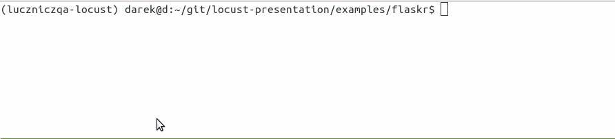
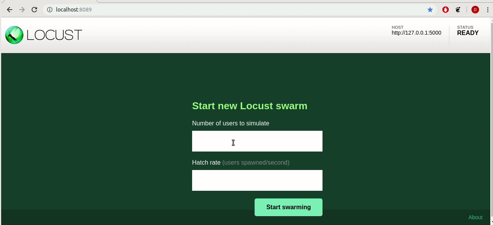
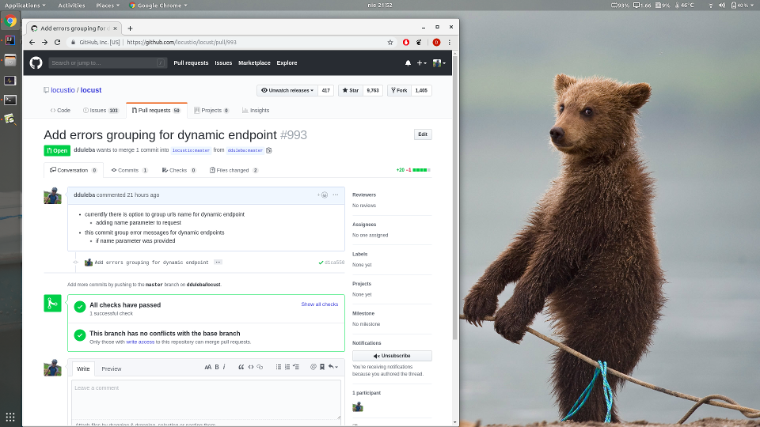

:title: Pythonowa Szarańcza

.. :skip-help: true

:css: css/my.css

.. header::

    .. image:: img/logo.png
        :width: 80
        :height: 80
        :align: left

    Pythonowa szarańcza

.. footer::
    NOKIA

----

Darek Duleba
------------

Software Engineer at Nokia

----

=========== ========================    ======
O mnie
=========== ========================    ======
rodzina     10-ty rok małżeństwa

            2 synów - Filip i Damian

praca       13-ty rok pracy             Specjalizuje się w autmatyzacji testów i nie tylko

            - ALU (6+)

            - Genesys (5+)

            - Nokia (1+)

sport       Triathlon                    początki zabawy z triathlonem

            - pływanie

            - jazda na rowerze

            - bieganie

open source dduleba_github_             kontrybucje do radish-bdd_

                                        wdna_ (webowe narzędzia wspierające analizy dna)

                                        locust_exporter_

                                        locust_dockprom_ - dockprom + locust exporter

=========== ========================    ======

* bierzący status na kwiecień 2019

----

Performance testing (Testy wydajnościowe)
=========================================

* Proces testowania mający na celu określenie wydajności oprogramowania.

======================= =================================================== =================================================
Rodzaj testowania       Opis                                                Przypadki testowe w praktyce
======================= =================================================== =================================================
endurance (stabilności) Skupienie na stabilności systemu w przedziala czasu 72 godzinne testy przy stałym obciążeniu.
                        Weryfikuje brak problemów z zasobami (np.
                        wycieki pamięci, połącenia do bazy, pula wątków)    scenariusze użytkowników bez przeciążania systemu

stress (przeciążające)  Typ testowania wydajnościowego wykonywany,          5 minutowe testy skupiające się na konkretnym
                        by określić jak system lub jego moduł pracuje       obszarze. Ich celem jest określenie maksymalnej
                        na przewidywanej lub wyspecyfikowanej granicy       wydajności przy ograniczonych zasobach
                        lub poza nią lub też przy ograniczonym dostępie
                        do pamięci lub serwera.

======================= =================================================== =================================================

sjsi_sylabus_

istqb_performance_testing_

Pozostałe rodzaje testowania wydajnościowego:

Load (obciążeniowe), Scalability (skalowalności), Spike, Concurrency (równoległości przetwarzania), Capacity

.. note::

    Types of performance testing:
        * Load Testing (Testowanie obciążeniowe)
        * Stress Testing (Testowanie przeciążające)
        * Scalability Testing (Testowanie skalowalności)
        * Spike Testing
        * Endurance Testing
        * Concurrency Testing (testowanie równoległości przetwarzania)
        * Capacity Testing

    * Types of performance tests:
        * static testing
        * dynamic testing

    * Performance Testing
        Performance testing is an umbrella term including any kind of testing focused on
        performance (responsiveness) of the system or component under different volumes of
        load.

    * Load Testing
        Load testing focuses on the ability of a system to handle increasing levels of anticipated
        realistic loads resulting from transaction requests generated by controlled numbers of
        concurrent users or processes.

    * Stress Testing
        Stress testing focuses on the ability of a system or component to handle peak loads
        that are at or beyond the limits of its anticipated or specified workloads. Stress
        testing is also used to evaluate a system’s ability to handle reduced availability of
        resources such as accessible computing capacity, available bandwidth, and memory.

    * Scalability Testing
        Scalability testing focuses on the ability of a system to meet future efficiency
        requirements which may be beyond those currently required. The objective of these
        tests is to determine the system’s ability to grow (e.g., with more users, larger amounts
        of data stored) without violating the currently specified performance requirements or
        failing. Once the limits of scalability are known, threshold values can be set and
        monitored in production to provide a warning of problems which may be about to arise..
        In addition the production environment may be adjusted with appropriate amounts of
        hardware.

    * Spike Testing
        Spike testing focuses on the ability of a system to respond correctly to sudden bursts
        of peak loads and return afterwards to a steady state.

    * Endurance Testing
        Endurance testing focuses on the stability of the system over a time frame specific to
        the system’s operational context. This type of testing verifies that there are no resource
        capacity problems (e.g., memory leaks, database connections, thread pools) that may
        eventually degrade performance and/or cause failures at breaking points.

    * Concurrency Testing
        Concurrency testing focuses on the impact of situations where specific actions occur
        simultaneously (e.g., when large numbers of users log in at the same time).
        Concurrency issues are notoriously difficult to find and reproduce, particularly when
        the problem occurs in an environment where testing has little or no control, such as
        production.

    * Capacity Testing
        Capacity testing determines how many users and/or transactions a given system will
        support and still meet the stated performance objectives. These objectives may also
        be stated with regard to the data volumes resulting from the transactions.

----

Narzędzia do testów wydajnościowych
===================================

================    =======
Nazwa               Opis
================    =======
Gatling_            Open sourceowe narzędzie do genorowania obciążenia.

                    Potężne narzędzie z możliwością nagrywania rcuhu webowego z kolorowymi raportami.

locust_             Open sourceowe narzędzie do genorowania obciążenia.

                    Umożliwia definicje zachowania użytkownika

                    Scenariusze użytkownika w kodzie **python**'owym

                    - Skalowalny
                        - tysiące użytkowników na jednej maszynie (event-based)
                    - Rozporoszony
                        - uruchomienie na wielu maszynach umożliwia symulowanie miliony równoczesnych użytkowników

dockprom_           Rozwiązanie do monitorowania hostów oraz konterów Dockerowych
locust_exporter_    exporeter statystyk locusta dla Prometheus'a
================    =======

NOTE: Narzęzdia z których korzystamy w naszej grupie w bieżących projektach
NOTE: Na potrzeby prezentacji udało mi się stworzyć ciekawy projeckt dockprom + locust_exporter = locust_dockprom_

----

locust w virtualenvie
=====================

.. image:: img/locust_installation.gif
    :align: left
    :width: 520px
    :height: 360px

Tworzenie virtualenv'a - virtualenvwrapper_

.. code-block:: bash

    $ pip install virtualenv
    $ pip install virtualenvwrapper
    $ mkvirtualenv -p python3 locust
    (locust)$

Instalacja locusta

.. code-block::

    (locust)$ pip install locustio

Wczytanie virtualnego środowiska

.. code-block::

    $ source virtualenvwrapper.sh
    $ workon locust
    (locust)$ locust --help

dokumentacja instalacji_locusta_

----

locust w dockerze
=================

running_docker_with_locust_

Docker file z locustio

.. code-block:: Docker

    FROM python:3.6.6-alpine3.8

    RUN apk --no-cache add g++ \
          && apk --no-cache add zeromq-dev \
          && pip install locustio pyzmq

    EXPOSE 8089 5557 5558

    ENTRYPOINT ["/usr/local/bin/locust"]

.. code-block:: sh

    $ cd ~/git/locust/
    $ docker build --tag locustio/locust .

Docker z wykorzystaniem za pomocą exec'a

.. code-block:: Docker

    FROM locustio/locust

    WORKDIR /locust

    env PYTHONPATH /locust

    ENTRYPOINT []
    CMD ["tail","-f","/dev/null"]

.. code-block:: sh

    $ cd ~/git/locust-presentation/examples/packaging
    $ docker build --tag dduleba/locust .
    # to mount examples/flaskr/ we need to chage directory
    $ cd ~/git/locust-presentation
    $ docker run --cpus 1.0 --network host -d \
        --name locustd -p 8089:8089 \
        --mount src="$(pwd)",target=/locust,type=bind dduleba/locust

----

.. image:: img/locust_web.gif

----

Monitorowanie
=============

===================================     ================    =====================     ==============================   ================
Opcja                                   dockprom_           locust_exporter_           locust_dockprom_                 detale
===================================     ================    =====================     ==============================   ================
**Prometheus**                          tak                                             tak                             Monitoring system & time series database
**Grafana**                             tak                                             tak                             The open platform for analytics and monitoring
**cAdvisor**                            tak                                             tak                             Analyzes resource usage and performance characteristics of running containers.
**NodeExporter**                        tak                                             tak                             Prometheus exporter for machine metrics
AlertManager                            tak                                             tak                             handles alerts sent by client applications such as the Prometheus server
locust exporter **for prometheus**                          tak                         tak                             python library
locust exporter **on docker**                               w odpowiednim forku       odporny na restarty locusta
locust exporter **with prometheus**                                                     tak
locust exporter **with grafana**                                                        tak
===================================     ================    =====================     ==============================   ================

----

locust_dockprom
===============

Wybudowanie kontenera dla locust_exporter_

.. code-block:: sh

    git clone https://github.com/dduleba/locust_exporter.git
    cd locust_exporter
    docker build --tag locust_exporter .

Wytartowanie locust_dockprom_

.. code-block:: sh

    git clone https://github.com/dduleba/locust-dockprom.git
    cd locust-dockprom
    # LOUST_HOST - LOCUST HOST ADDR (reachable from docker)
    export LOCUST_HOST=`ip -4 addr show scope global dev docker0 | grep inet | awk '{print \$2}' | cut -d / -f 1`

    docker-compose up -d

----

.. image:: img/locust_dockprom.gif

----

Test App
========

.. image:: img/flaskr.gif
    :align: left

flask flaskr_ example
---------------------

.. code-block:: sh

    $ export FLASK_APP=flaskr
    $ export FLASK_ENV=development
    $ flask init-db
    $ flask run

flaskr w dockerze
-----------------

Utwórz Dockerfile w flask examples\\tutorial

.. code-block:: Docker

    FROM python:3-alpine

    ADD . /app
    WORKDIR /app
    RUN pip install -e .
    ENV FLASK_APP flaskr
    ENV FLASK_ENV development
    RUN flask init-db

    ENTRYPOINT ["flask"]
    CMD ["run","--host","0.0.0.0"]

.. code-block:: sh

    $ docker build --tag flaskr:alpine .
    $ docker run \
        --cpus 1.0 \
        --memory 4G \
        --restart unless-stopped \
        -d \
        -p 5000:5000 \
        --name flaskr \
        flaskr:alpine

----

Przygotowanie zapytań
=====================

.. image:: img/flaskr_get.gif
    :align: left

----

Przygotowanie zapytań
=====================

.. image:: img/flaskr_register_user.gif
    :align: left

----

flaskr - przykładowy scenariusz
===============================

Requests_ - HTTP dla ludzi
--------------------------

.. code-block:: Python

    from random import random

    import requests

    # Initial condition
    user_id = random()
    username = 'test_user_{}'.format(user_id)
    userpassword = 'test_user_pass_{}'.format(user_id)

    # Pobranie głównej strony
    session = requests.Session()
    r = session.get('http://localhost:5000/')
    print('get status code: ', r.status_code)
    print('get content: ', r.content)

    # rejestracja użytkownika - HTTP post request
    r = session.post('http://localhost:5000/auth/register',
                     data={'username': username,
                           'password': userpassword})
    print('register status code: ', r.status_code)

    r = session.post('http://localhost:5000/auth/login',
                     data={'username': username,
                           'password': userpassword})
    print('login status code: ', r.status_code)
    print('login cookies: ', session.cookies)

    r = session.post('http://localhost:5000/create',
                     data={'title': 'post example by {}'.format(username),
                           'body': 'witam na ŁuczniczQA meetup'})
    print('post add status code: ', r.status_code)

----

Get request
===========

skrypt
------

.. code-block:: Python

    session = requests.Session()
    r = session.get('http://localhost:5000/')
    print('get status code: ', r.status_code)

locust
------
locust_host_attribute_

locust_usng_HTTP_client_

Każda instancja TaskSet'a (HTTPLocust'a) zawiera atrybut client HttpSession. Klasa HttpSession dziedziczy z requests.Session

.. code-block:: Python

    from locust import HttpLocust, TaskSet, task

    class IndexTaskSet(TaskSet):
        @task()
        def index(self):
            self.client.get("/")

    class IndexLocust(HttpLocust):
        task_set = IndexTaskSet
        min_wait = 5000
        max_wait = 10000
        host='http://127.0.0.1:5000'

----

Uruchomienie locusta - virtualenv
=================================

.. code-block:: sh

    $ workon locust
    $ cd ~/git/locust-presentation/examples/flaskr/posts_list
    $ locust

----

Post request
============

.. code-block:: Python

    # rejestracja użytkownika - HTTP post request
    r = session.post('http://localhost:5000/auth/register',
            data={ 'username': username, 'password': userpassword })
    print('register status code: ', r.status_code)

.. code-block:: Python

    from locust import HttpLocust, TaskSet, task

    class UserRegisterTaskSet(TaskSet):

        def on_start(self):
            self.prefix = id(self)
            self.user_id = 0
            print(self.prefix)

        @staticmethod
        def user_register(client, user_name, user_password):
            client.post(
                "/auth/register",
                data={
                    'username': user_name,
                    'password': user_password
                }
            )

        @task()
        def register(self):
            self.user_id += 1
            user_name = 'test_user_{}'.format(self.prefix, self.user_id)
            user_password = 'test_user_password_{}'.format(self.user_id)
            self.user_register(self.client, user_name, user_password)

    class IndexLocust(HttpLocust):
        task_set = UserRegisterTaskSet
        min_wait = 5000
        max_wait = 10000
        host = 'http://127.0.0.1:5000'

----

Uruchomienie locusta - docker exec
==================================

* NOTE locustd container needs to be run once before docker exec

----

Task sequence
=============

.. code-block:: Python

    from examples.flaskr.user_add_post.locustfile import UserAddPostTaskSet
    from examples.flaskr.user_login.locustfile import UserLoginTaskSet
    from examples.flaskr.user_register.locustfile import UserRegisterTaskSet
    from examples.flaskr.utils import _get_post_id
    from locust import HttpLocust, TaskSequence, seq_task

    class UserDeletePostTaskSet(TaskSequence):

        def on_start(self):
            user_id = id(self)
            self.user_name = 'test_user_{}'.format(user_id)
            self.user_password = '{}x'.format(self.user_name)
            UserRegisterTaskSet.user_register(client=self.client,
                                              user_name=self.user_name,
                                              user_password=self.user_password)
            UserLoginTaskSet.user_login(client=self.client,
                                        user_name=self.user_name,
                                        user_password=self.user_password)
            self.post_id = None

        @seq_task(1)
        def add_post(self):
            title = '{}: title'.format(self.user_name)
            body = "to be deleted"
            response = UserAddPostTaskSet.user_add_post(client=self.client,
                                                        title=title,
                                                        body=body, catch_response=True)
            self.post_id = _get_post_id(content=response.content)

        @seq_task(2)
        def delete(self):
            if self.post_id is None:
                return

            self.client.post(
                '/{post_id}/delete'.format(post_id=self.post_id),
                name='/[post_id]/delete'
            )
            self.post_id = None

    class IndexLocust(HttpLocust):
        task_set = UserDeletePostTaskSet
        min_wait = 5000
        max_wait = 10000
        host = 'http://127.0.0.1:5000'

----

Połączenie kilku requestów w całość
===================================

.. code-block:: Python

    from examples.flaskr.posts_list.locustfile import IndexTaskSet
    from examples.flaskr.user_add_post.locustfile import UserAddPostTaskSet
    from examples.flaskr.user_delete_post.locustfile import UserDeletePostTaskSet
    from examples.flaskr.user_edit_post.locustfile import UserEditPostTaskSet
    from examples.flaskr.user_login.locustfile import UserLoginTaskSet
    from examples.flaskr.user_register.locustfile import UserRegisterTaskSet
    from locust import HttpLocust, TaskSet

    class UserAllTaskSet(TaskSet):
        tasks = {UserEditPostTaskSet: 4,
                 UserAddPostTaskSet: 4,
                 UserDeletePostTaskSet: 3,
                 UserLoginTaskSet: 2,
                 UserRegisterTaskSet: 1,
                 IndexTaskSet: 8}

    class IndexLocust(HttpLocust):
        task_set = UserAllTaskSet
        min_wait = 5000
        max_wait = 10000
        host = 'http://127.0.0.1:5000'

----

Definicja własnego klient'a
===========================

locust_testing_other_systems_using_custom_client_

.. code-block:: Python

    import logging
    import random
    import time

    from locust import Locust, TaskSet, events, task

    log = logging.getLogger()

    class LoggingClient(object):

        def __getattr__(self, name):
            def wrapper(*args, **kwargs):
                start_time = time.time()
                try:
                    time.sleep(1 / random.randint(100, 1000))
                    method = getattr(log, name)
                    result = method(*args, **kwargs)
                except Exception as e:
                    total_time = int((time.time() - start_time) * 1000)
                    events.request_failure.fire(request_type="log", name=name, response_time=total_time, exception=e)
                else:
                    total_time = int((time.time() - start_time) * 1000)
                    events.request_success.fire(request_type="log", name=name, response_time=total_time, response_length=0)

            return wrapper

    class LoggingLocust(Locust):

        def __init__(self, *args, **kwargs):
            super().__init__(*args, **kwargs)
            self.client = LoggingClient()

    class ApiUser(LoggingLocust):
        min_wait = 100
        max_wait = 1000

        class task_set(TaskSet):
            @task(10)
            def error(self):
                self.client.error("error info")

            @task(5)
            def info(self):
                self.client.info("Test Info")

----

.. image:: img/locust_own_log_client.gif

----

pull request
============

Add_errors_grouping_for_dynamic_endpoint_

----

Pytania i odpowiedzi
====================

źródła_prezentacji_

.. _hovercraft: https://hovercraft.readthedocs.io/en/latest/presentations.html
.. _virtualenvwrapper: https://virtualenvwrapper.readthedocs.io/en/latest/
.. _instalacji_locusta: https://docs.locust.io/en/latest/installation.html
.. _locust: https://locust.io/
.. _locustfile: https://docs.locust.io/en/stable/writing-a-locustfile.html
.. _locust_local_url: http://localhost:8089/
.. _locust_host_attribute: https://docs.locust.io/en/stable/writing-a-locustfile.html#the-host-attribute
.. _locust_usng_HTTP_client: https://docs.locust.io/en/stable/writing-a-locustfile.html#using-the-http-client
.. _flaskr: http://flask.pocoo.org/docs/1.0/tutorial/
.. _Requests: http://docs.python-requests.org/en/master/user/quickstart/
.. _dockprom: https://github.com/stefanprodan/dockprom
.. _locust_docker: https://docs.locust.io/en/latest/running-locust-docker.html
.. _locust_exporter: https://github.com/dduleba/locust_exporter
.. _locust_dockprom: https://github.com/dduleba/locust-dockprom
.. _locust_testing_other_systems_using_custom_client: https://docs.locust.io/en/stable/testing-other-systems.html
.. _prometheus: https://prometheus.io/
.. _sjsi_sylabus: https://sjsi.org/download/3319/
.. _istqb_performance_testing: https://www.istqb.org/documents/ISTQB%20CTFL-PT%20Syllabus%202018%20GA.pdf
.. _Gatling: https://gatling.io/
.. _dduleba_github: https://github.com/dduleba
.. _wdna: https://github.com/dduleba/wdna
.. _radish-bdd: https://github.com/radish-bdd/radish
.. _running_docker_with_locust: https://docs.locust.io/en/latest/running-locust-docker.html
.. _dariusz_duleba: https://www.linkedin.com/in/dariusz-duleba/
.. _Add_errors_grouping_for_dynamic_endpoint: https://github.com/locustio/locust/pull/993
.. _źródła_prezentacji: https://github.com/dduleba/locust-presentation