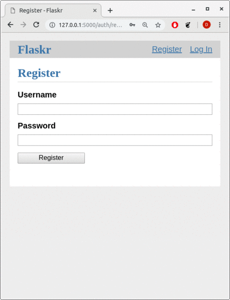

:title: Pythonowa Szarańcza

.. :skip-help: true

:css: css/my.css

.. header::

    .. image:: img/logo.png
        :width: 209
        :height: 50

.. .. footer::

..    Pythonowa szarańcza - "Hello World"

----

Pythonowa Szarancza
===================

Dariusz Duleba

----

O mnie
======

rodzina
-------

    * 10 rok małżeństwa
    * 2 synów
        * Filip i Damian

praca
-----

    * 13 rok pracy
        * ALU (6+)
        * Genesys (5+)
        * Nokia (1+)

wolny czas
----------

    * jeszcze raz rodzina - masa atrakcji :)
    * sport
        * pływanie + jazda na rowerze + bieganie = triathlon
            * 3 starty
            * 3 rok treningów

----

Reklama :)
==========

* Open source'owe narzędzie do testów wydajnościowych

* Umożliwia definicje zachowania użytkownika

* Scenariusze użytkownika w kodzie

.. image:: img/logo_python.gif

* Skalowalny
    * tysiące użytkowników na jednej maszynie (event-based)

* Rozporoszony
    * uruchomienie na wielu maszynach umożliwia symulowanie miliony równoczesnych użytkowników

* webowy interfejs

.. image:: img/www_screen.png
        :width: 400
        :height: 300

----

Instalacja
==========

Tworzenie virtualenv'a

.. code-block::

    $ pip install virtualenv
    $ pip install virtualenvwrapper
    $ mkvirtualenv -p python3 locust
    (locust)$

Instalacja

.. code-block::

    (locust)$ pip install locustio

Wczytanie virtualnego środowiska

.. code-block::

    $ source virtualenvwrapper.sh
    $ workon locust
    (locust)$ locust --help

oficjalna dokumentacja instalacji_

.. _instalacji: https://docs.locust.io/en/latest/installation.html

----

Hello World!
=================

.. code-block:: python

    from locust import Locust, TaskSet, task

    class MyTaskSet(TaskSet):
        @task
        def my_task(self):
            print("executing my_task")

    class MyLocust(Locust):
        task_set = MyTaskSet
        min_wait = 5000
        max_wait = 15000

locust_local_url_

Dokumentacja locustfile_

----

Weight
======

.. code-block:: python

    class WebUserLocust(Locust):
        weight = 9
    ...

    class MobileUserLocust(Locust):
        weight = 1
    ...

Command line run:

.. code-block:: sh

    $ locust -f locustfile_weight.py --no-web --client 20 --hatch 20

.. code-block:: sh

    $ locust -f locustfile_weight.py --no-web --client 20 --hatch 20 MobileUserLocus

----

Test App
========

flask flaskr_ example
---------------------

.. code-block:: sh

    $ export FLASK_APP=flaskr
    $ export FLASK_ENV=development
    $ flask init-db
    $ flask run

----

Wstęp do testowania aplikacji
=============================

Requests_ - HTTP dla ludzi
--------------------------

.. code-block:: Python

    from random import random

    import requests

    # Pobranie głównej strony

    r = requests.get('http://localhost:5000/')
    print(r.status_code)
    print(r.content)

    # rejestracja użytkownika - HTTP post request
    user_id = random()
    username = 'test_user_{}'.format(user_id)
    userpassword = 'test_user_pass_{}'.format(user_id)
    r = requests.post('http://localhost:5000/auth/register',
                      data={'username': username,
                            'password': userpassword})
    print(r.status_code)

    # logowanie
    session = requests.Session()

    r = session.post('http://localhost:5000/auth/login',
                     data={'username': username,
                           'password': userpassword})
    print(r.status_code)
    print(session.cookies)

----

Get request
===========

locust_host_attribute_

locust_usng_HTTP_client_

Każda instancja TaskSet'a (HTTPLocust'a) zawiera atrybut client HttpSession. Klasa HttpSession dziedziczy z requests.Session

.. code-block:: Python

    from locust import HttpLocust, TaskSet, task

    class IndexTaskSet(TaskSet):
        @task()
        def index(self):
            self.client.get("/")

    class IndexLocust(HttpLocust):
        task_set = IndexTaskSet
        min_wait = 5000
        max_wait = 5000
        host='http://127.0.0.1:5000'

----

Post request
============

.. code-block:: Python

    from locust import HttpLocust, TaskSet, task

    class RegisterTaskSet(TaskSet):

        def on_start(self):
            self.prefix = id(self)
            self.user_id = 0
            print(self.prefix)

        @task()
        def register(self):
            self.user_id += 1
            self.client.post(
                "/auth/register",
                data={
                    'username': 'test_user_{}_{}'.format(self.prefix, self.user_id),
                    'password': 'test_password_{}_{}'.format(self.prefix, self.user_id)
                }
            )

    class IndexLocust(HttpLocust):
        task_set = RegisterTaskSet
        min_wait = 5000
        max_wait = 5000
        host = 'http://127.0.0.1:5000'

----

Task sequence
=============

.. code-block:: Python

    import time

    from locust import HttpLocust, task, TaskSequence, seq_task

    class LoggedUserSequence(TaskSequence):

        def on_start(self):
            self.prefix = id(self)
            self.user_id = 0
            print(self.prefix)
            self.user_name = 'test_user_{}_{}'.format(self.prefix, self.user_id)
            self.user_password = 'test_password_{}_{}'.format(self.prefix, self.user_id)
            self.client.post(
                "/auth/register",
                data={
                    'username': self.user_name,
                    'password': self.user_password
                }
            )

        @seq_task(1)
        def login(self):
            self.client.post(
                "/auth/login",
                data={
                    'username': self.user_name,
                    'password': self.user_password
                }
            )

        @seq_task(2)
        @task(5)
        def new(self):
            self.client.post(
                "/create",
                data={
                    'title': '{}: {} title'.format(self.user_name, self.user_id),
                    'body': "my body text"
                }
            )

    ...

----

Flaskr w docker'ze
==================

.. code-block:: Docker

    FROM ubuntu:latest
    RUN apt-get update -y
    RUN apt-get install -y python-pip python-dev build-essential

    ADD . /app
    WORKDIR /app
    RUN pip install -e .
    ENV FLASK_APP flaskr
    ENV FLASK_ENV development
    RUN flask init-db

    ENTRYPOINT ["flask"]
    CMD ["run","--host","0.0.0.0"]

.. code-block:: bash

    $ docker build --tag flaskr .
    $ docker run --name flaskr -p 5001:5000 flaskr

----

Monitorowanie applikacji
========================

dockprom_

* A monitoring solution for Docker hosts and containers

.. code-block:: bash

    $ git clone https://github.com/stefanprodan/dockprom
    $ cd dockprom
    $ ADMIN_USER=admin ADMIN_PASSWORD=admin docker-compose up -d

----

Locust w docker'ze
==================

locust_docker_

----

Definicja własnego klient'a
===========================

https://docs.locust.io/en/stable/testing-other-systems.html

----

Narzędzia
=========

Pythonowa szarańcza locust_

Zarządzanie virtualnymi środowiskami virtualenvwrapper_

Biblioteka do generowania prezentacji hovercraft_

.. _hovercraft: https://hovercraft.readthedocs.io/en/latest/presentations.html

.. _virtualenvwrapper: https://virtualenvwrapper.readthedocs.io/en/latest/
.. _locust: https://locust.io/
.. _locustfile: https://docs.locust.io/en/stable/writing-a-locustfile.html
.. _locust_local_url: http://localhost:8089/
.. _locust_host_attribute: https://docs.locust.io/en/stable/writing-a-locustfile.html#the-host-attribute
.. _locust_usng_HTTP_client: https://docs.locust.io/en/stable/writing-a-locustfile.html#using-the-http-client
.. _flaskr: http://flask.pocoo.org/docs/1.0/tutorial/
.. _Requests: http://docs.python-requests.org/en/master/user/quickstart/
.. _dockprom: https://github.com/stefanprodan/dockprom
.. _locust_docker: https://docs.locust.io/en/latest/running-locust-docker.html